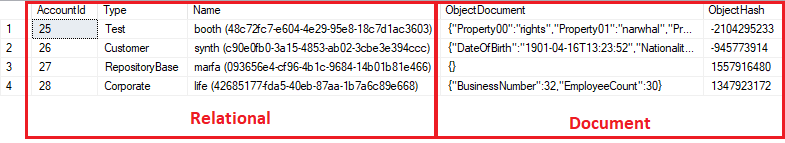
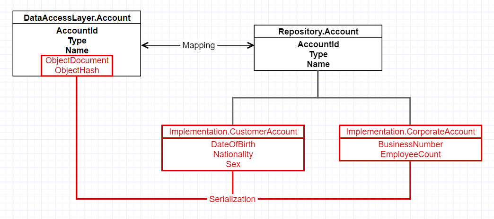

# Hybrid Relational/Document Database Example

The purpose of this repo is to provide an example of a hybrid relational/document database which was sketched as a proof of concept/experiment. This example uses C# and MS SQL 2016.

## Problem

We have a system which is deployed in multiple different territories. There is *universal* data structures/constraints/rules that hold true for all territories. There are also *specific* data structures/constraints/rules that apply only in specific territories. 

The problem is that the database must be strict enough to enforce the *universal* data structures/constraints/rules but also flexible enough to enable rapid re-use.

## Solution

Relational databases can provide strict rules, but with the downside that they are not very flexible. In order to add a new property, for example, one must update the tables/views/functions, data access layer, etc.

Document database exist on the other end of the spectrum. They are highly flexible and easier to change, but ensuring the integrity of the data is more difficult than in relational databases.

This example solution to problem is to create a hybrid relational/document database. Those properties which are *universal* can be stored in a relational way and anything which is *specific* can be stored in a document.

## Downsides

Such a hybrid is never going to be as fast as either a purely relational or document database. Understanding how entites are packed and unpacked from the database, while not overly complex, requires care and attention. 
 

