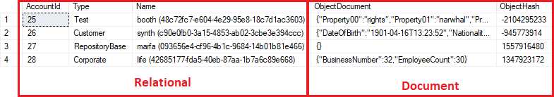

# Hybrid Relational/Document Database Example

The purpose of this repo is to provide an example of a hybrid relational/document database which was sketched as a proof of concept/experiment. This example uses C# and MS SQL 2016.

## Setup

1. Clone/download this repo.
2. Create the database by either:
    * Open the solution in Visual Studio and publish the database project to a HRDE database on your localhost.
    * Create a HRDE on your localhost and execute the ./Hrde.Database/dbo/Tables/Accounts.sql script.
3. Open the solution in Visual Studio and run all unit tests.

4. Debug through Hrde.RepositoryLayer.Tests.Integration.Serialization.ObjectDocumentSerializerTests to understand the serialization.
5. Debug through Hrde.RepositoryLayer.Tests.Integration.Repositories.AccountsRepositoryTests to understand the complete process.

### Problem

We have a system which is deployed in multiple different territories. There is *universal* data structures/constraints/rules that hold true for all territories. There are also *specific* data structures/constraints/rules that apply only in specific territories. 

The problem is that the database must be strict enough to enforce the *universal* data structures/constraints/rules but also flexible enough to enable rapid re-use.

### Solution

Relational databases can provide strict rules, but with the downside that they are not very flexible. In order to add a new property, for example, one must update the tables/views/functions, data access layer, etc.

Document database exist on the other end of the spectrum. They are highly flexible and easier to change, but ensuring the integrity of the data is more difficult than in relational databases.

This example solution to problem is to create a hybrid relational/document database. Those properties which are *universal* can be stored in a relational way and anything which is *specific* can be stored in a document.



### Downsides

Such a hybrid is never going to be as fast as either a purely relational or document database. Understanding how entites are packed and unpacked from the database, while not overly complex, requires care and attention. 
 
## Packing/Unpacking

In the below example we have an Account entity. The SQL table definition is:
```SQL
CREATE TABLE [dbo].[Accounts] (
    [AccountId]      INT           IDENTITY (1, 1) NOT NULL,
    [Type]    VARCHAR (128) NOT NULL,
    [Name]           VARCHAR (128) NOT NULL,
    [ObjectDocument] VARCHAR (MAX) NOT NULL,
    [ObjectHash]     INT           NOT NULL,
    CONSTRAINT [PK_Accounts] PRIMARY KEY CLUSTERED ([AccountId] ASC),
    CONSTRAINT [CK_Accounts_Name] CHECK ((0)<len([Name])),
    CONSTRAINT [CK_Accounts_ObjectDocument] CHECK (isjson([ObjectDocument])>(0)),
    CONSTRAINT [IX_Accounts_AccountId] UNIQUE NONCLUSTERED ([AccountId] ASC),
    CONSTRAINT [UQ_Accounts_Name] UNIQUE NONCLUSTERED ([Name] ASC)
);
```

Key to the hybrid database solution is how the entities are packed/unpacked. 

There will be two representations of each entity in the C# code. One represents the entity as it will be stored in the database and one represents the entity as it will be used in code.


In the above example, we have an Account entity. In the data access layer (and database), we have an AccountId, Type, Name, ObjectDocument and ObjectHash. The AccountId, Type and Name are *universal* properties, meaning that *all* deployments of the system will have Accounts with those properties.

We also have two types of Account; a CustomerAccount and a CorporateAccount. Both of these inherit from the base Repository.Account and therefore have the universal properties. However the CustomerAccount has a DateOfBirth, Nationality and Sex, whereas the CorporateAccount has a BusinessNumber. The properties of the descendent classes are stored in the ObjectDocument.

## IObjectDocumentSerializer

The IObjectDocumentSerializer is responsible for packing and unpacking any non-universal properties. Note that the non-universal properties are serialized as JSON and that the universal properties are *not* serialized.

```C#
public interface IObjectDocumentSerializer
{
   T2 Deserialize<T1, T2>(T1 objectDocumentContainer) where T1 : ObjectDocumentContainer;
   IEnumerable<T2> Deserialize<T1, T2>(IEnumerable<T1> objectDocumentContainers) where T1 : ObjectDocumentContainer;

   T2 Serialize<T1, T2>(T1 repositoryObject) where T2 : ObjectDocumentContainer;
}
```

The Hrde.RepositoryLayer.Tests.Integration.Serialization.ObjectDocumentSerializerTests has a number of tests which demonstrate the de/serialization of the entities. Debug through these tests until the mechanism is understood.

## I<Entity>Repository

To provide a clean interface, the data access and serialization are packed into I<Entity>Repository. For example, the IAccountsRepository provides the following interface:
```C#
public interface IAccountsRepository
{
   Task<IEnumerable<T>> GetAccountsAsync<T>(IDbConnection dbConnection) where T : Account;
   Task<int> InsertAccountAsync<T>(IDbTransaction dbTransaction, T account) where T : Account;
   Task<bool> UpdateAccountAsync<T>(IDbTransaction dbTransaction, T account) where T : Account;
   Task<bool> DeleteAccountAsync<T>(IDbTransaction dbTransaction, T account) where T : Account;
}
```

The AccountsRepository implementation has, for example:
```C#
public async Task<int> InsertAccountAsync<T>(IDbTransaction dbTransaction, T account) where T : Account
{
   _logger.LogInformation($"Inserting account '{account}'...");
   var dalObject = this._objectDocumentSerializer.Serialize<T, DalModels.Account>(account);
   return await this._dbContext.InsertAccountAsync(dbTransaction, dalObject);
}
```

There are a number of tests in the Hrde.RepositoryLayer.Tests.Integration.Repositories.AccountsRepositoryTests. Debug through these tests until the mechanism is understood.

# Conclusion

This example hopefully shows how the hybrid database works in the Proof of Concept. The aim is to create some entity archetypes where the *universal* properties/structures/rules/constraints can be defined once in a core library and easily extended in territory specific deployments. 


## Footnote

A test was performed on this design of a table with 4 relational columns and a document column. The table was populated with 5,000,000 records, each record having 60 properties within the document column of different types (numbers, dates, text). Blocks of 1,000 records were randomly retrieved in 0.3-0.4 seconds.
